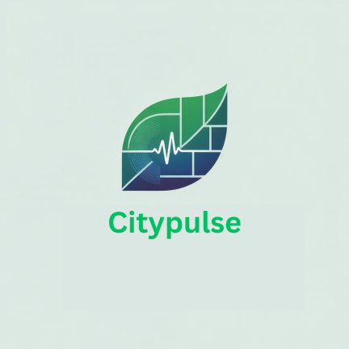

<div align="center">
  
  <h1>🌆 CityPulse</h1>
  <p><i>"Empowering Citizens, Improving Cities."</i></p>
  <p><i>"Urban Health at Your Fingertips."</i></p>
  <p><i>"Data-Driven Decisions for a Better Tomorrow."</i></p>

  [](https://developer.android.com)
  [](https://www.java.com)
  [](https://developer.android.com/about/versions/nougat)
  [](LICENSE)
</div>

---

## 📖 Overview

**CityPulse** is a powerful, native Android application designed to bridge the gap between urban data and citizen awareness. By monitoring and visualizing key urban health parameters—such as infrastructure, air quality, and population density—CityPulse provides meaningful insights that empower users to understand and compare the health of various cities.

Built with **Java** and the **Android SDK**, the app leverages real-world CSV datasets to provide a seamless and informative experience.

---

## ✨ Core Features

| Feature | Description |
|:--- |:--- |
| 🔐 **Secure Authentication** | A complete onboarding experience with Splash, Login, and Registration screens. |
| 🏠 **City Exploration** | A dynamic home dashboard featuring a searchable list of cities powered by `RecyclerView`. |
| 📊 **Urban Health Metrics** | Deep-dive into specific city data including **Health Index**, **AQI**, **Green Cover**, **Urban Heat Island**, and **Flood Risk**. |
| ⚖️ **Side-by-Side Comparison** | Compare two cities simultaneously to analyze performance across various metrics. |
| 👤 **User Profiles** | Manage your personal information and home city preferences. |
| ⚙️ **App Settings** | Customize your experience with localized settings and logout options. |
| 📄 **CSV Data Engine** | Dynamically parses urban data from a local `cities_data.csv` for up-to-date information. |

---

## 🛠️ Tech Stack & Architecture

- **Language:** Java
- **UI Framework:** XML Layouts with Material Design 3 (M3) components.
- **Data Handling:** Custom CSV Parsing via `AssetsManager`.
- **Components:** `RecyclerView`, `CardView`, `ConstraintLayout`, `MaterialToolbar`.
- **Build System:** Gradle (Kotlin DSL).
- **Architecture:** Standard Android Activity-based architecture with separated data models and adapters.

---

## 📂 Project Roadmap

```text
CityPulse/
├── app/
│   ├── src/main/
│   │   ├── assets/           # Real-world CSV data (cities_data.csv)
│   │   ├── java/             # Source code (Activities, Models, Adapters)
│   │   ├── res/              # UI Resources (Layouts, Drawables, Values)
│   │   └── AndroidManifest.xml
│   └── build.gradle.kts      # App configurations
└── settings.gradle.kts       # Project structure
```

---

## 🚀 Getting Started

### 📋 Prerequisites
- **Android Studio** (Hedgehog 2023.1.1+)
- **JDK 11** or higher
- **Android SDK** API level 34 (Target)

### ⚙️ Installation & Setup
1. **Clone the Repository:**
   ```bash
   git clone https://github.com/invo-coder19/CityPulse.git
   ```
2. **Open Project:** Launch Android Studio and select the `CityPulse` folder.
3. **Sync Gradle:** Let Android Studio download dependencies and sync the project.
4. **Run:** Connect a physical device or start an emulator and click the **Run** ▶️ button.

---

## 🧪 Testing

The project includes both unit and instrumented tests to ensure stability:
- **Unit Tests:** `./gradlew test`
- **Instrumented Tests:** `./gradlew connectedAndroidTest`

---

## 🤝 Contributing

We welcome contributions! If you have suggestions for new features or data improvements:
1. Fork the Project.
2. Create your Feature Branch (`git checkout -b feature/AmazingFeature`).
3. Commit your Changes (`git commit -m 'Add some AmazingFeature'`).
4. Push to the Branch (`git push origin feature/AmazingFeature`).
5. Open a Pull Request.

---

## 📄 License

Distributed under the MIT License. See `LICENSE` for more information.

<div align="center">
  <br>
  Built with ☕ and ❤️ for better cities.
</div>
